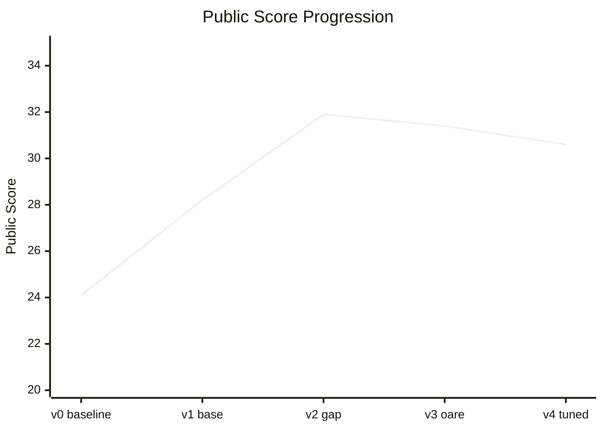

# Deep Past Challenge — Old Assyrian Machine Translation

> [中文版](./README.zh-TW.md)

A Kaggle competition project: translating **Old Assyrian** cuneiform transliterations
(written ~4,000 years ago) into **English**.

Fewer than 12 scholars worldwide can read Old Assyrian, yet tens of thousands of clay
tablets in museums remain untranslated. This project explores using a byte-level NLP
model to help decode one of humanity's earliest written records.

Competition: [Deep Past Initiative - Machine Translation](https://kaggle.com/competitions/deep-past-initiative-machine-translation)

**Metric:** `score = sqrt(BLEU × chrF++)` — the geometric mean of word-level (BLEU) and
character-level (chrF++) accuracy.

---

## Score Progression

| Version | Public | Private | Δ | Key change |
|---------|--------|---------|------|------------|
| v0 — Baseline | 24.1 | 23.9 | — | byt5-small, 20 epochs, stock starter script |
| v1 — Bigger model | 28.2 | 27.4 | +4.0 | byt5-base, cosine LR + semantic sentence alignment |
| **v2 — Gap normalization** | **31.9** | **32.5** | +3.7 | Unified damaged-text pre/post-processing (**best on both public & private**) |
| v3 — External data | 31.4 | 31.6 | −0.5 | + OARE corpus (domain mismatch, did not beat v2) |
| v4 — Tuned params | 30.6 | 31.3 | −1.3 | + label smoothing, warmup (eval chrF=45.5 but leaderboard dropped) |

> Final Kaggle ranking uses the private score. **v2-gap is the best on both public and
> private** — v3 and v4 improved offline metrics yet neither surpassed v2 on the board.
>
> **Final result:** Private Score **32.46**, rank **1356** (8 submissions). The selected
> final submission was v2-gap — confirming the "trust the leaderboard" call.



---

## What each version did

### v0 — Baseline (24.1)
Stock competition starter code, unmodified.
- **Model:** `google/byt5-small` (~300M params)
- **Training:** 20 epochs, batch size 4, LR 2e-4, beam search = 4

### v1 — Bigger model (28.2, +4.0)
The simplest win: swap small → base.
- **Model:** `google/byt5-base` (~580M params, ~2× larger)
- **Training:** 10 epochs, batch size 8, cosine LR schedule with warmup
- **Alignment:** added sentence-transformers semantic matching to expand 1,561 documents
  into ~8,300 sentence pairs

### v2 — Gap normalization (31.9, +3.7)
Comprehensive normalization of damaged text, unifying training and inference formats.
- **Pre-processing:** collapse varied damage markers `[...]`, `…`, `xx`, `x` → `<gap>` / `<big_gap>`
- **Post-processing:** special-character normalization (ḫ→h, subscript digits), gap-token
  restoration, removal of redundant glosses, fraction conversion (0.5→½), de-duplication
  and punctuation cleanup
- **Scripts:** `dpc-train-v2-gap.py` + `dpc-infer-v2-gap.py`

### v3 — External data (public 31.4, −0.5 — failed experiment)
Tried expanding training data with the external OARE corpus — it **never beat v2**.
- **Symptom:** eval chrF kept rising, but the public score didn't improve and swung wildly across checkpoints (27.7–31.4)
- **Diagnosis:** OARE data sits in a different domain than `train.csv`, pulling the model
  off the test distribution
- **Takeaway:** external data must be filtered carefully — **data quality > data quantity**.
  Reverted to a train.csv-only path and pivoted to parameter tuning instead.
- **Scripts:** `dpc-train-v3-oare.py` + `extract_sentences_oare.py`

### v4 — Parameter tuning (public 30.6, −1.3 — offline metric ≠ leaderboard, again)
Back to clean data, squeezing more out of low-risk training tricks — and the **best-ever
offline metric still scored lower on the board**.
- **Changes:** label smoothing (0.1), warmup (200 steps), 15 epochs, fixed 300-sample eval set for faster validation
- **Training:** Kaggle P100, ~7 hr / 12,285 steps; eval chrF 36.4 → 43.1 → **45.5** (highest in the project)
- **Result:** yet public was only 30.6 and private 31.3 — **both below v2**; label smoothing likely made outputs too conservative
- **Inference:** beam=8, length_penalty=1.3, repetition_penalty=1.2, optional MBR decoding
- **Scripts:** `dpc-train-v4-tuned.py` (LS=0.1), `dpc-train-v4b-ls02.py` (LS=0.2 variant), `dpc-infer-v4-improved.py`

> **The project's most important lesson:** both v3 and v4 raised eval chrF while the
> leaderboard fell. Repeatedly quantifying and correctly diagnosing the gap between an
> offline metric and real performance shows more research judgment than just chasing a number.

---

## Project structure

```
deep_past_challenge/
├── dpc-train-v2-gap.py        # v2 training (gap normalization)
├── dpc-infer-v2-gap.py        # v2 inference
├── dpc-train-v3-oare.py       # v3 training (external data, failed experiment)
├── dpc-train-v4-tuned.py      # v4 training (tuned params, LS=0.1)
├── dpc-train-v4b-ls02.py      # v4 variant (LS=0.2)
├── dpc-infer-v4-improved.py   # v4 inference (beam=8 + MBR)
├── extract_sentences_oare.py  # OARE sentence-pair extraction
├── check_env.py               # GPU / package version check
├── requirements.txt           # dependencies
├── CLAUDE.md                  # full competition notes & strategy (Chinese)
├── README.md / README.zh-TW.md # this file (English / 中文)
├── reference/                 # top-scorer reference scripts (not used directly)
└── deep-past-initiative-machine-translation/   # competition dataset (git-ignored)
```

> The dataset, model weights, and external corpora are excluded via `.gitignore` due to size.

---

## Setup & run

```bash
pip install -r requirements.txt
python check_env.py              # verify GPU & package versions
python dpc-train-v4-tuned.py     # train (place the competition dataset first)
python dpc-infer-v4-improved.py
```

- **Training environment:** Kaggle Notebook (Tesla P100 GPU)
- **GPU budget:** ~83 hours

---

## Stack

- **Model:** Google ByT5 (byte-level T5 — no tokenizer vocabulary, well suited to
  low-resource languages and damaged text)
- **Framework:** HuggingFace Transformers + Trainer
- **Sentence alignment:** sentence-transformers (semantic similarity)
- **Language:** Python

---

## Key takeaways

1. **Offline metric ≠ leaderboard.** Both v3 and v4 raised eval chrF yet dropped on public/private — validate hypotheses against the board, not the dev set.
2. **Data quality > quantity.** v3 showed that dumping in external data causes domain mismatch and *lowers* the score.
3. **Early wins have the best ROI.** A bigger model (+4.0) and gap normalization (+3.7) drove the biggest jumps; marginal gains shrink later.
4. **Model size matters.** byt5-base clearly beats byt5-small.
5. **Log failures honestly.** v2-gap remained the best model; showing that v3/v4 didn't beat it is more valuable than dressing up the numbers.
