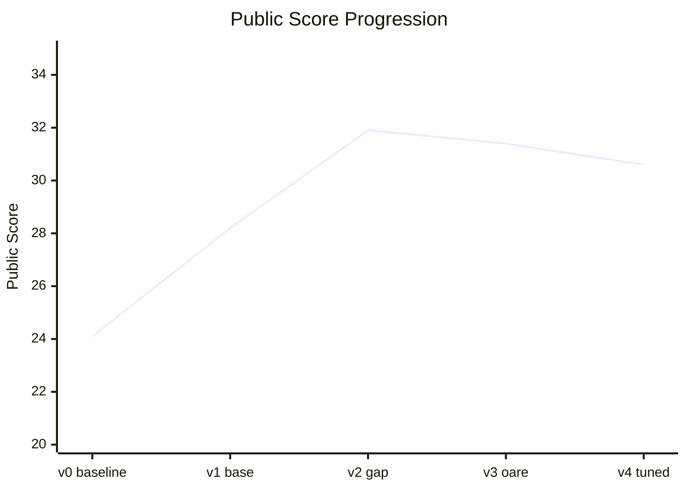

# Deep Past Challenge — 古亞述語機器翻譯

> [English version](./README.md)

Kaggle 比賽：將 4000 年前的**古亞述語（Old Assyrian）**楔形文字轉寫翻譯成**英文**。
全世界僅有不到 12 位專家能解讀古亞述語，而博物館中仍有上萬份泥板尚未翻譯——這個專案嘗試用 byte-level NLP 模型協助解讀人類最早的書寫紀錄之一。

比賽連結：[Deep Past Initiative - Machine Translation](https://kaggle.com/competitions/deep-past-initiative-machine-translation)

**評分公式**：`score = sqrt(BLEU × chrF++)`（詞級準確度與字元級準確度的幾何平均）

---

## 分數進度

| 版本 | Public | Private | 提升 | 核心做法 |
|------|--------|---------|------|----------|
| v0 - Baseline | 24.1 | 23.9 | — | byt5-small, 20 epochs, 原始 starter 腳本 |
| v1 - 換大模型 | 28.2 | 27.4 | +4.0 | byt5-base, 10 epochs, cosine LR + 語意句子對齊 |
| **v2 - Gap 正規化** | **31.9** | **32.5** | +3.7 | 統一破損標記前/後處理（**最佳，public 與 private 皆第一**） |
| v3 - 外部資料 | 31.4 | 31.6 | −0.5 | + OARE 語料（domain mismatch，未超越 v2） |
| v4 - 參數優化 | 30.6 | 31.3 | −1.3 | + label smoothing, warmup（eval chrF=45.5 但 leaderboard 退步） |

> Kaggle 最終排名以 Private Score 計。**v2-gap 在 public 與 private 上都是最佳**——v3、v4 雖然離線指標更好，卻都未能超越 v2。
>
> **最終成績**：Private Score **32.46**，排名 **1356**（共 8 次提交）。最終選擇的提交正是 v2-gap，印證了「以 leaderboard 為準」的判斷。



---

## 各版本詳細做法

### v0 — Baseline（24.1）
直接使用比賽提供的 starter code，未做修改。
- **模型**：`google/byt5-small`（~300M 參數）
- **訓練**：20 epochs, batch size 4, LR 2e-4，beam search = 4

### v1 — 換大模型（28.2, +4.0）
最簡單的改進：把模型從 small 換成 base。
- **模型**：`google/byt5-base`（~580M 參數，約 2 倍大）
- **訓練**：10 epochs, batch size 8, cosine LR schedule with warmup
- **句子對齊**：加入 sentence-transformers 做語意比對，把 1,561 份文件展開成 ~8,300 句子對

### v2 — Gap 正規化（31.9, +3.7）
針對破損文本（gap）做全面正規化，統一訓練與推論的格式。
- **前處理**：統一各種破損標記 `[...]`, `…`, `xx`, `x` → `<gap>` / `<big_gap>`
- **後處理**：特殊字元正規化（ḫ→h、下標數字）、gap token 還原、移除冗餘註解、分數符號轉換（0.5→½）、重複詞與標點清理
- **腳本**：`dpc-train-v2-gap.py` + `dpc-infer-v2-gap.py`

### v3 — 外部資料（public 31.4, −0.5 — 失敗實驗）
嘗試加入 OARE 外部語料擴充訓練資料，**結果未能超越 v2**。
- **現象**：eval chrF 持續上升，但公開分數未提升、且不同 checkpoint 波動大（27.7~31.4）
- **診斷**：OARE 資料與 train.csv 的 domain 不同，模型偏離測試集分佈
- **結論**：外部資料需嚴格篩選，**資料品質 > 資料數量**；決定回退到 train.csv-only 路線，改走參數優化
- **腳本**：`dpc-train-v3-oare.py` + `extract_sentences_oare.py`

### v4 — 參數優化（public 30.6, −1.3 — 再次驗證離線指標 ≠ 排行榜）
回到乾淨資料，用低風險的參數技巧再榨分數，**eval 指標創新高卻反而降分**。
- **改進**：label smoothing (0.1)、warmup (200 steps)、15 epochs、固定 300 筆 eval set 加速驗證
- **訓練**：Kaggle P100，~7hr / 12285 steps；eval chrF 36.4 → 43.1 → **45.5**（全專案最高）
- **結果**：然而 public 僅 30.6、private 31.3，**雙雙低於 v2**——label smoothing 可能讓輸出過於保守
- **推論**：beam=8, length_penalty=1.3, repetition_penalty=1.2, 可選 MBR decoding
- **腳本**：`dpc-train-v4-tuned.py`（LS=0.1）、`dpc-train-v4b-ls02.py`（LS=0.2 變體）、`dpc-infer-v4-improved.py`

> **本專案最重要的一課**：v3 與 v4 兩次實驗的 eval chrF 都上升，leaderboard 卻下降。
> 能反覆量化並正確診斷「離線指標與真實表現脫鉤」，比單純堆高分數更能展現研究判斷力。

---

## 專案結構

```
deep_past_challenge/
├── dpc-train-v2-gap.py        # v2 訓練（gap 正規化）
├── dpc-infer-v2-gap.py        # v2 推論
├── dpc-train-v3-oare.py       # v3 訓練（外部資料，失敗實驗）
├── dpc-train-v4-tuned.py      # v4 訓練（參數優化，LS=0.1）
├── dpc-train-v4b-ls02.py      # v4 變體（LS=0.2）
├── dpc-infer-v4-improved.py   # v4 推論（beam=8 + MBR）
├── extract_sentences_oare.py  # OARE 句子對提取
├── check_env.py               # GPU / 套件版本檢查
├── requirements.txt           # 相依套件
├── CLAUDE.md                  # 完整比賽筆記與策略（中文）
├── README.md / README.zh-TW.md # 本檔案（English / 中文）
├── reference/                 # 參考用的高分選手腳本（不直接使用）
└── deep-past-initiative-machine-translation/   # 比賽資料集（未納入版控）
```

> 比賽資料集、模型權重、外部語料因體積過大，皆透過 `.gitignore` 排除。

---

## 環境與執行

```bash
pip install -r requirements.txt
python check_env.py          # 確認 GPU 與套件版本
python dpc-train-v4-tuned.py # 訓練（需先放入比賽資料集）
python dpc-infer-v4-improved.py
```

- **訓練環境**：Kaggle Notebook（Tesla P100 GPU）
- **GPU 預算**：~83 小時

---

## 技術棧

- **模型**：Google ByT5（byte-level T5，無需 tokenizer 詞表，特別適合罕見語言與破損文本）
- **框架**：HuggingFace Transformers + Trainer
- **句子對齊**：sentence-transformers（語意相似度）
- **語言**：Python

---

## 關鍵心得

1. **離線指標 ≠ 排行榜**：v3 與 v4 的 eval chrF 都上升，public/private 卻下降——必須以 leaderboard 為準驗證假設。
2. **資料品質 > 數量**：v3 證明亂加外部資料會 domain mismatch、反而降分。
3. **早期改進 CP 值最高**：換大模型（+4.0）與 gap 正規化（+3.7）帶來最大躍進；越後期邊際效益越低。
4. **模型大小有感**：byt5-base 比 small 明顯更好。
5. **誠實記錄失敗**：v2-gap 至今仍是最佳模型；如實呈現 v3/v4 未超越，比粉飾分數更有價值。
